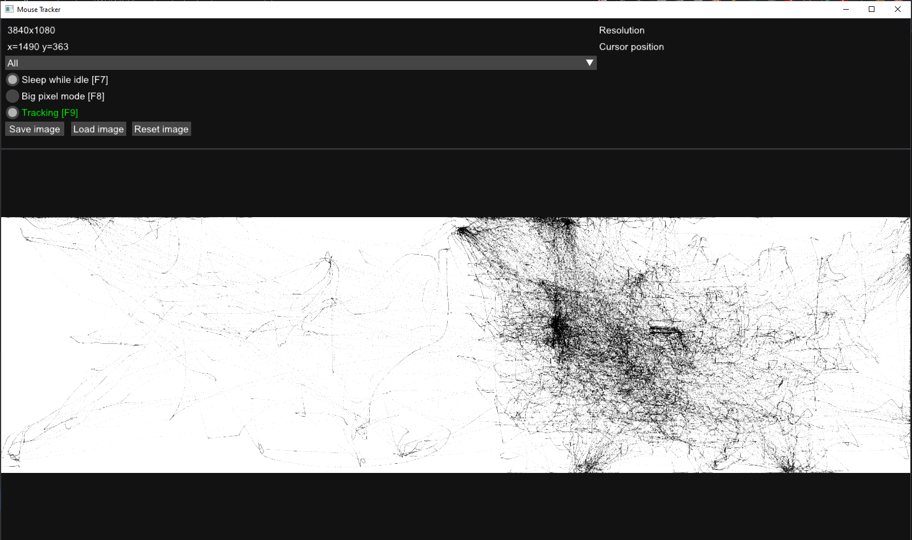

# MouseTracker

An application to track your mouse movement and visualize it for you. You can track either one specific monitor or all monitors.



# Build

Windows only! This project uses premake as it's build system. The premake5 binaries are already provided.  
For additional information use:
```
vendor\premake5 --help
```

## Clone

```
git clone https://github.com/cunterrainer/MouseTracker.git
```
```
cd MouseTracker
```

## Visual Studio

```
vendor\premake5.exe vs2022
```
This should generate a .sln file

## Make

```
vendor\premake5.exe gmake [cc]
```

GCC should already be the default compiler, however you can explicitly specify it if you'd like.  
GCC:   --cc=gcc  
Clang: --cc=clang

### Build

```
make [-j] config=<configuration>
```
Configurations:
 - debug_x86
 - debug_x64 (default, the same as just using `make`)
 - release_x86
 - release_x64

`-j` flag tells make to compile multithreaded

```
make help
```
for additional information
